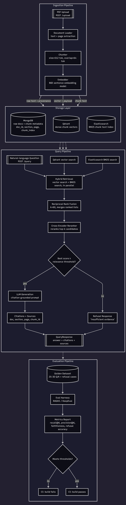

# LexRAG

**Contract & case-law intelligence platform** — a legal retrieval-augmented
generation system that answers questions over contracts and case filings
with traceable citations, and refuses to answer when the evidence isn't
there.

> **Status:** Sprint 5, Days 1–6 complete, plus a Day 4 production-hardening
> pass (duplicate detection, document browser/delete, document-scoped
> queries, persistent model cache). Ingestion, hybrid retrieval, reranking,
> citation-grounded generation, the full REST API, the golden-dataset
> evaluation harness, and a wired-and-demonstrated CI evaluation quality gate
> (FR-12) are implemented and Dockerized end-to-end. End-to-end query latency
> was cut nearly in half on Day 6 (51.2s → 26.3s avg); refusal precision on
> adversarial queries improved but has not yet reached the documented 100%
> target — see [Known Limitations](#known-limitations) and
> [Roadmap](#roadmap).

## Overview

Paralegals burn hours per matter manually searching thousands of pages of
contracts and prior filings for relevant clauses and precedent. Keyword
search misses paraphrased queries; a generic LLM chat interface answers
confidently without evidence, which is unusable — and risky — for legal
work.

LexRAG ingests PDF contracts and case-law documents, indexes them for
**hybrid retrieval** (dense vector search + BM25 keyword search, merged via
Reciprocal Rank Fusion and refined by a cross-encoder reranker), and
generates answers that cite only retrieved passages — refusing to answer
when the corpus doesn't contain sufficient evidence. Retrieval and
generation quality are measured against a golden dataset and enforced as a
CI quality gate, not tuned by eyeballing outputs.

Full requirements: [`docs/01-requirements.md`](docs/01-requirements.md).
Architecture decisions and trade-offs: [`docs/architecture.md`](docs/architecture.md).

## Architecture



Editable source: [`docs/architecture.mmd`](docs/architecture.mmd). Render
changes at [mermaid.live](https://mermaid.live) or a Mermaid-aware editor,
then re-export the PNG to `docs/screenshots/LexRAG.png` to keep this in
sync.

## Features

- PDF ingestion with configurable chunking and full provenance metadata
  (document, section, page, chunk index).
- Hybrid retrieval: parallel dense vector (Qdrant) + BM25 (Elasticsearch)
  search, merged with Reciprocal Rank Fusion.
- Cross-encoder reranking of fused candidates, with a configurable
  pre-rerank candidate cap (`RERANK_INPUT_TOP_K`) to bound the dominant cost
  in query latency.
- Citation-grounded generation that cites only retrieved passages, with
  explicit refusal when evidence is insufficient or the question requires
  synthesis the retrieved evidence doesn't support.
- `POST /upload`, `POST /query`, `GET /documents`, and
  `DELETE /documents/{doc_id}` REST API with a typed response contract
  (answer, citations, sources, confidence).
- Duplicate-upload detection (SHA-256 content hash) — a byte-identical
  re-upload is skipped entirely and returns the existing document instead
  of re-ingesting.
- Document-scoped queries — `POST /query`'s optional `document_ids` filters
  retrieval (via native Qdrant/Elasticsearch filters, not post-filtering) to
  one or more specific documents instead of the whole corpus.
- Golden-dataset evaluation harness (RAGAS/DeepEval) reporting recall@K,
  precision@K, faithfulness, refusal accuracy, and per-stage latency, with
  automatic failure-stage classification.
- CI evaluation quality gate (FR-12) — `evaluation/gate.py` +
  `scripts/evaluation_gate.py` (`make evaluate-gate`) fail the build if
  recall@10, precision@5, faithfulness, or negative-case refusal fall below
  `docs/01-requirements.md` §7's thresholds. Wired into
  `.github/workflows/ci.yml` and demonstrated failing and passing against
  real runs — see [CI Evaluation Gate](#ci-evaluation-gate).
- Fully Dockerized local stack (API + MongoDB + Qdrant + Elasticsearch),
  including a persistent volume for downloaded embedding/reranker model
  weights so rebuilding the API image doesn't re-download them.

## Tech Stack

| Layer | Choice |
|---|---|
| API | FastAPI |
| Metadata / document store | MongoDB |
| Vector store | Qdrant |
| Keyword index | Elasticsearch (BM25) |
| Embeddings | BAAI/bge-m3 (sentence-transformers) |
| Reranker | BAAI/bge-reranker-v2-m3 |
| Generation | OpenAI-compatible LLM behind a provider-agnostic interface |
| Evaluation | RAGAS + DeepEval |
| Package/env management | uv |
| Testing | Pytest |
| Lint/format/type-check | Ruff, mypy |
| CI | GitHub Actions |
| Containerization | Docker Compose |

Full rationale and alternatives considered for each choice:
[`docs/architecture.md`](docs/architecture.md).

## Installation

Requires **Python 3.13** and [**uv**](https://docs.astral.sh/uv/).

```bash
# Install uv (if not already installed)
curl -LsSf https://astral.sh/uv/install.sh | sh   # macOS/Linux
# irm https://astral.sh/uv/install.ps1 | iex        # Windows PowerShell

# Clone, configure, and install (creates .venv, installs deps + git hooks)
git clone <repo-url> lexrag && cd lexrag
cp .env.example .env   # fill in OPENAI_API_KEY etc.
make install
```

`make install` runs `uv sync --extra dev` + `uv run pre-commit install`. No
`make` on your system (plain Windows cmd/PowerShell)? Run those two commands
directly — see [Development](#development) for the full command reference.

## Quick Start

```bash
# Run the full stack (API + MongoDB + Qdrant + Elasticsearch)
cp .env.example .env   # fill in OPENAI_API_KEY etc.
docker compose up

# Health check
curl http://localhost:8000/health

# Upload a PDF, then ask a question against the indexed corpus
curl -X POST http://localhost:8000/upload -F "file=@contract.pdf;type=application/pdf"
curl -X POST http://localhost:8000/query -H "Content-Type: application/json" \
  -d '{"question": "What is the termination notice period?"}'

# Browse ingested documents
curl http://localhost:8000/documents

# Run tests
make test
```

Interactive API docs (Swagger UI) are at `http://localhost:8000/docs` once
the stack is up.

## Development

Everyday commands are wrapped in the `Makefile` so CI and local development
run the exact same checks. `make help` lists all targets; the ones you'll
use most:

| Command | What it does |
|---|---|
| `make install` | Create/refresh `.venv`, install deps (incl. dev extras), install pre-commit hooks |
| `make run` | Run the API locally with auto-reload (`uv run python -m api`) |
| `make test` | Run the unit test suite (`uv run pytest`) |
| `make test-cov` | Run tests with a coverage report |
| `make lint` | Lint with Ruff |
| `make format` | Auto-format with Ruff (rewrites files) |
| `make check` | Full quality gate: format check + lint + mypy + tests — what CI runs |
| `make evaluate` | Run the golden-dataset evaluation harness (needs the live stack + `OPENAI_API_KEY`) |
| `make evaluate-gate` | Check the most recent evaluation report against `docs/01-requirements.md` §7's thresholds (FR-12); exits non-zero on failure |

Every target just wraps a `uv run ...` command, so if `make` isn't available
(there's no native `make` on plain Windows cmd/PowerShell — use Git Bash,
WSL, or install one), open the `Makefile` and run the underlying command
directly.

CI (`.github/workflows/ci.yml`) has two jobs. `quality` runs on every push
and pull request: `uv sync --locked`, then `ruff check`, `ruff format
--check`, `mypy`, and `pytest`, in that order — identical to `make check`. A
`uv.lock` mismatch with `pyproject.toml` fails the build immediately, before
any other check runs. `evaluation-gate` (FR-12) runs `make evaluate` +
`make evaluate-gate` on a manual (`workflow_dispatch`) trigger against a
self-hosted runner with the golden corpus pre-seeded — see
[CI Evaluation Gate](#ci-evaluation-gate) for why it isn't automatic on
every push.

## Project Structure

```
lexrag/
├── api/                 # FastAPI app, routes, request/response schemas
├── configs/             # Environment-driven settings, logging setup
├── data/                # Local working storage: raw/, processed/, golden/
├── docs/                # Requirements, architecture (ADR), diagrams, experiment notes
├── evaluation/          # Golden-dataset harness, RAGAS/DeepEval metric wrappers
├── generation/          # Citation-grounded prompting, refusal logic, LLM interface
├── ingestion/           # PDF loaders, chunking, embedding, store fan-out
├── retrieval/           # Vector store, keyword store, RRF fusion, reranker
├── scripts/             # One-off operational scripts (seeding, eval runs, resets)
└── tests/               # unit/, integration/, fixtures/ mirroring the layout above
```

Each package's `__init__.py` documents what belongs there and which sprint
day populates it — see [`CLAUDE.md`](CLAUDE.md) for the full repository
layout and engineering conventions.

## Roadmap

| Day | Focus | Status |
|---|---|---|
| 1 | Discovery & solution design — requirements, architecture, scaffold | ✅ Done |
| 2 | Data & ingestion foundation — Docker Compose, chunker, MongoDB schema | ✅ Done |
| 3 | Hybrid retrieval — Qdrant + Elasticsearch, RRF merge | ✅ Done |
| 4 | Cited generation & API — reranker, `/query`, `/upload`, plus a production-hardening pass (dedup, document browser/delete, document-scoped queries, persistent model cache) | ✅ Done |
| 5 | Evaluation & quality — golden dataset (7 real SEC-filed contracts, 30 Q/A cases), retrieval/generation/refusal metrics, error analysis | ✅ Done |
| 6 | Hardening & portfolio — CI evaluation quality gate (FR-12, demonstrated failing/passing), refusal-prompt fix, reranker latency optimization, final docs | ✅ Done |

Lint/type/test CI (`.github/workflows/ci.yml`) and the `Makefile` command
surface landed early, as infrastructure hardening ahead of Day 2. Day 6 wired
the metrics this evaluation harness already produces into an actual CI
quality gate (FR-12), demonstrated it failing against a real run and against
deliberately degraded configurations, cut end-to-end query latency by ~49%,
and made a measured (partial) improvement to refusal precision. Full
methodology and numbers:
[`docs/experiments/evaluation_notes_day6.md`](docs/experiments/evaluation_notes_day6.md).

## Evaluation

The evaluation harness (`evaluation/`, Day 5) runs a 30-case golden Q/A
dataset (`data/golden/golden_qa.jsonl` — 22 positive cases across all 10
required clause topics, 8 adversarial/out-of-scope negative cases) through
the same retrieval → rerank → generation pipeline `POST /query` uses in
production, and reports:

- **Retrieval** — Recall@5/10 and Precision@5/10, computed directly against
  the golden set's expected documents (not delegated to RAGAS), for each of
  dense-only, sparse-only, and hybrid+RRF — so the value each retrieval
  stage adds is visible independently, not just the combined pipeline.
- **Generation** — Faithfulness, Context Precision, Context Recall, and
  Answer Relevancy via RAGAS's LLM-as-judge metrics, for answerable
  (non-refused) cases only. DeepEval wraps each RAGAS score in a
  threshold/pass-fail assertion (`docs/architecture.md` §2.10) — the
  CI/test-runner integration layer around RAGAS's scores, not a second,
  redundant LLM-judge pass.
- **Refusal behaviour** — accuracy across *all* 30 cases, plus false
  refusals (an answerable case incorrectly refused) and false acceptances
  (a case with no supporting evidence incorrectly answered) reported as
  separate counts, not averaged into one number — for a legal tool, an
  unflagged hallucination is a materially worse failure than an overly
  cautious refusal.
- **Latency** — average retrieval, reranker, generation, and end-to-end
  time across all 30 cases.
- **Error analysis** — every failing case is automatically attributed to
  the first pipeline stage that couldn't have produced a correct answer
  (retrieval / reranker / refusal / generation), so failures point at where
  to look, not just that something failed.

Acceptance thresholds are defined in
[`docs/01-requirements.md` §7](docs/01-requirements.md#7-measurable-acceptance-criteria).
Reproduce locally with:

```bash
docker compose up -d mongo qdrant elasticsearch
uv run python scripts/seed_corpus.py     # once, to seed the golden dataset's corpus
make evaluate                            # or: uv run python scripts/run_evaluation.py
make evaluate-gate                       # check the report against §7's thresholds (FR-12)
```

Full methodology, dataset design rationale, and baseline results:
[`docs/experiments/evaluation_notes.md`](docs/experiments/evaluation_notes.md).

### Benchmark numbers

**Day 5 baseline** (2026-08-05, `gpt-5.6-luna` — a one-off substitution) vs.
**Day 6 final** (2026-08-06, `gpt-4.1-mini` — the project's actual configured
default), same 7-document real-contract corpus, same 30 golden cases. Day 6
changed two things from the Day 5 config: `RERANK_INPUT_TOP_K` 20 → 12
(validated against this golden set, zero measured recall cost — see
`docs/adr/001-reranker-onnx-backend.md` and
`docs/experiments/evaluation_notes_day6.md` §2) and the active generation
prompt `LEGAL_RAG_V1` → `LEGAL_RAG_V2` (a targeted refusal fix, §3 of that
doc):

| Metric | Day 5 baseline | Day 6 final | vs. `docs/01-requirements.md` §7 |
|---|---|---|---|
| Recall@10 (hybrid) | 1.00 | 1.00 | ✅ ≥ 0.85 |
| Precision@5 (hybrid) | 0.88 | 0.88 | ✅ ≥ 0.70 |
| Faithfulness | 0.95 | 0.98 | ✅ ≥ 0.90 |
| Context Precision | 0.65 | 0.79 | no documented threshold |
| Context Recall | 0.96 | 1.00 | no documented threshold |
| Answer Relevancy | 0.80 | 0.94 | no documented threshold |
| Refusal accuracy | 93.33% (28/30) | 90.00% (27/30) | — |
| Negative-case false acceptances | 2 | **2** | ❌ target is 0 (100% refusal) |
| Avg reranker latency | 53.5s | **23.4s** | — |
| Avg end-to-end latency | 56.4s | **26.3s (-53%)** | ❌ NFR-1 target ≤ 6s (P95) — still reranker-bound |

**Latency: cut by more than half.** `RERANK_INPUT_TOP_K=12` (validated
against every positive case's expected document staying in the reranked top
8, not just a single-query heuristic) took avg reranker latency from 53.5s
to 23.4s. An ONNX Runtime backend for the same model was also measured and
**rejected** — 1.02x speedup, not worth the added dependency
(`docs/adr/001-reranker-onnx-backend.md`). Still ~9x over the NFR-1 P95
budget — the reranker remains CPU-bound with no GPU/DirectML path on this
machine.

**Refusal: improved, not solved.** The Day 6 refusal-prompt fix
(`LEGAL_RAG_V2`) fixed one of the three false acceptances measured against
`gpt-4.1-mini` specifically (see
`docs/experiments/evaluation_notes_day6.md` §4 for the `gpt-4.1-mini`
before/after: 3 → 2), but the same two cases that were the *original* Day 5
gap (`negative-nonexistent-01`, `negative-misleading-01`) survive — both
generation-stage judgment failures on topically-real-but-non-answering
evidence, not retrieval or threshold issues. **100% refusal on negative
cases — the CI gate's one currently-failing criterion — is not yet met.**

Full methodology, every intermediate measurement (including two failed
latency/degradation hypotheses that are informative in their own right), and
the CI gate demonstration: `docs/experiments/evaluation_notes_day6.md`.
Day 5's original baseline and root-cause analysis:
`docs/experiments/evaluation_notes.md`. Every report referenced above is
preserved under `evaluation/reports/` (gitignored, filenames like
`day6_after_gpt-4.1-mini.md` — regenerate the *current* run with
`make evaluate`, which overwrites only `latest.md`/`latest.json`).

A follow-up comparison against `gpt-5.4-nano` (same dataset/corpus/config,
only the LLM changed) is in
[`docs/experiments/evaluation_notes_gpt54nano.md`](docs/experiments/evaluation_notes_gpt54nano.md)
— it also includes a repeat-run finding worth reading before trusting any
single-run model comparison from this harness: re-running gpt-5.6-luna with
nothing else changed shifted its own refusal accuracy from 93.33% to 100%.

### CI Evaluation Gate

`evaluation/gate.py` (pure pass/fail logic) + `scripts/evaluation_gate.py`
(`make evaluate-gate`) check an already-generated report against
`docs/01-requirements.md` §7's thresholds — `recall_at_10 >= 0.85`,
`precision_at_5 >= 0.70`, `faithfulness >= 0.90`, and (FR-12, §7.5)
`refusal_false_acceptances == 0` — and exit non-zero if any fail:

```bash
make evaluate       # run the pipeline, write evaluation/reports/latest.json
make evaluate-gate  # check latest.json against the thresholds; exits 1 on failure
```

Wired into `.github/workflows/ci.yml` as an `evaluation-gate` job, gated on
`workflow_dispatch` and a **self-hosted** runner rather than every push —
the golden corpus (`data/raw/sample_contracts/`) is real, licensed contract
text, deliberately gitignored (see that directory's README), so a
GitHub-hosted runner has no way to reproduce it from a checkout alone. The
job is real, tested YAML that runs correctly against a machine with the
corpus already seeded (like the one this project was developed on) — see
`docs/experiments/evaluation_notes_day6.md` §6 for why it isn't exercised by
GitHub's own infrastructure today.

**Demonstrated, on the record, both failing and passing** (§7.6):
running the gate against the *actual, unmodified* system already fails
(3 false acceptances on the pre-Day-6-fix baseline); three different
retrieval-configuration degradations were tried, and the cleanest —
pointing `QDRANT_COLLECTION`/`ELASTICSEARCH_INDEX` at fresh, never-indexed
names — cleanly fails `recall_at_10`/`precision_at_5`/`faithfulness`
(0.00/0.00/0.00), and reverting to the real names restores a pass on
exactly those three checks. The refusal check stays failing throughout,
including after reverting — a real, independent, currently-unresolved gap
(above), not a bug in the gate. Full transcript:
`docs/experiments/evaluation_notes_day6.md` §5.

### What the `confidence` field means (and doesn't)

`POST /query`'s response includes a `confidence` field
(`domain.generation.GenerationResult.confidence`). **This is the
cross-encoder reranker's relevance score for the single highest-ranked
retrieved chunk — not a calibrated measure of whether the generated answer
is correct.** Concretely:

- It reflects how well *one* chunk matches the question, not whether the
  full answer (which may synthesize several chunks) is accurate.
- A multi-part question whose evidence is spread across several chunks can
  report a *lower* `confidence` than a single-fact lookup, even when the
  synthesized answer is entirely accurate and well-cited — no chunk alone
  is a tight match for the whole question.
- It's the same score `Settings.generation_min_context_score` gates
  refusal on (FR-10) — a retrieval-relevance threshold, not an
  answer-correctness threshold.

This is documented, current behaviour, not a bug — and per this sprint's
scope, it is **not** being redesigned into a calibrated answer-confidence
score today. Treat `confidence` as "how relevant was the best single piece
of evidence," and rely on the `citations` list (which passages actually
support the answer) to judge whether an answer is trustworthy, not on this
field alone.

**Measured, not just asserted:** a follow-up analysis
(`scripts/confidence_correlation.py`) computed the actual correlation between
`confidence` and answer correctness/faithfulness across the golden dataset —
Pearson r ≈ 0 for both (see
[`docs/experiments/evaluation_notes.md`](docs/experiments/evaluation_notes.md#confidence-correlation-follow-up-measurement)
for the full results, caveats, and concrete examples, including one answer
that scored `confidence=0.92` while being completely unfaithful). Confidence
reliably flags "nothing relevant was retrieved at all," but carries no
further signal once something relevant is found.

## Known Limitations

Honest, measured gaps against `docs/01-requirements.md` §7's v1.0 acceptance
bar — not resolved this sprint, tracked here rather than glossed over. Full
detail: `docs/experiments/evaluation_notes_day6.md` §6.

- **100% refusal on negative cases (§7.5) is not met.** 2 of 30 golden cases
  are still answered when they should be refused
  (`negative-nonexistent-01`, `negative-misleading-01`) — both cases where
  retrieval returns real, topically-relevant evidence that doesn't actually
  contain the specific fact the question asks about. A Day 6 prompt fix
  (`LEGAL_RAG_V2`) closed one of three such failures measured against
  `gpt-4.1-mini`; this specific pair predates that fix and needs a further,
  more targeted iteration (see "Next steps" in the linked doc).
- **P95 query latency (NFR-1, ≤ 6s) is not met.** Day 6 cut avg end-to-end
  latency from 56.4s to 26.3s (-53%), but the CPU-only cross-encoder
  reranker remains ~9x over budget. No GPU/DirectML/OpenVINO acceleration
  path exists on the development machine; an ONNX Runtime backend was
  measured and rejected (1.02x — not a real speedup, see
  `docs/adr/001-reranker-onnx-backend.md`). Closing this gap needs either
  GPU hardware or a more aggressive lever (e.g. INT8 quantization) that
  hasn't been validated yet.
- **The CI evaluation gate is not automated on GitHub-hosted runners.** The
  golden corpus is real, licensed contract text, deliberately gitignored
  (`data/raw/sample_contracts/README.md`) — a GitHub-hosted runner can't
  reproduce it from a checkout. The `evaluation-gate` CI job is real and
  correctly wired, but only runs against a self-hosted runner with the
  corpus pre-seeded, triggered manually (`workflow_dispatch`), not on every
  push/PR.
- **Two of three deliberate retrieval-configuration degradations tried on
  Day 6 didn't move recall@10/precision@5** — this 8-document corpus's
  retrieval is more robust to configuration mistakes than expected; only an
  artificially emptied vector/keyword store cleanly failed those specific
  checks. A real demonstration of a *naturally occurring* retrieval
  regression would need a larger, more heterogeneous corpus.
- **Single-run measurements throughout.** RAGAS/DeepEval LLM-judge scores
  are not perfectly deterministic run-to-run (`docs/architecture.md` §2.10);
  a repeat run of an identical config previously shifted refusal accuracy
  from 93.33% to 100% (`docs/experiments/evaluation_notes_gpt54nano.md`).
  Treat every number in this README as directional, not a hypothesis-tested
  result.

## Future Improvements

Tracked as stretch goals in [`docs/01-requirements.md` §4](docs/01-requirements.md#4-stretch-goals):

- Pinecone vector-store adapter behind the existing retrieval interface,
  benchmarked against Qdrant.
- Structured termination-clause detection (beyond free-text Q/A).
- Streamed (token-by-token) `/query` responses.
- Query rewriting/decomposition for multi-part legal questions.
- Per-matter/client access control on top of the existing `document_ids`
  query filter (today it's an opt-in scoping parameter, not an
  authentication/authorization boundary).

## License

MIT — see [`LICENSE`](LICENSE).
