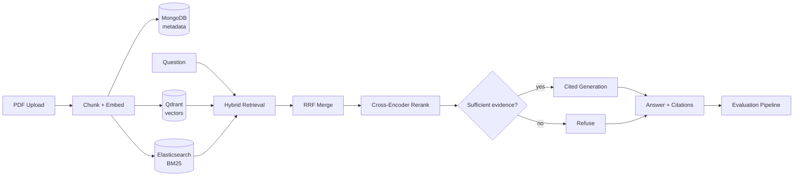

# LexRAG

**Contract & case-law intelligence platform** — a legal retrieval-augmented
generation system that answers questions over contracts and case filings
with traceable citations, and refuses to answer when the evidence isn't
there.

> **Status:** Sprint 5, Day 1 (Discovery & Solution Design) complete. This
> is a scaffold — requirements, architecture, and repository structure are
> in place; ingestion, retrieval, and generation are implemented Day 2–4
> (see [Roadmap](#roadmap)).

## Overview

Paralegals burn hours per matter manually searching thousands of pages of
contracts and prior filings for relevant clauses and precedent. Keyword
search misses paraphrased queries; a generic LLM chat interface answers
confidently without evidence, which is unusable — and risky — for legal
work.

LexRAG ingests PDF contracts and case-law documents, indexes them for
**hybrid retrieval** (dense vector search + BM25 keyword search, merged via
Reciprocal Rank Fusion and refined by a cross-encoder reranker), and
generates answers that cite only retrieved passages — refusing to answer
when the corpus doesn't contain sufficient evidence. Retrieval and
generation quality are measured against a golden dataset and enforced as a
CI quality gate, not tuned by eyeballing outputs.

Full requirements: [`docs/01-requirements.md`](docs/01-requirements.md).
Architecture decisions and trade-offs: [`docs/architecture.md`](docs/architecture.md).

## Architecture



Full diagram with ingestion/query/eval pipelines broken out:
[`docs/architecture.mmd`](docs/architecture.mmd).

## Features

- PDF ingestion with configurable chunking and full provenance metadata
  (document, section, page, chunk index).
- Hybrid retrieval: parallel dense vector (Qdrant) + BM25 (Elasticsearch)
  search, merged with Reciprocal Rank Fusion.
- Cross-encoder reranking of fused candidates before generation.
- Citation-grounded generation that cites only retrieved passages, with
  explicit refusal when evidence is insufficient.
- `POST /upload` and `POST /query` REST API with a typed response contract
  (answer, citations, sources).
- Golden-dataset evaluation harness (RAGAS/DeepEval) reporting recall@K,
  precision@K, and faithfulness, wired into CI as a quality gate.
- Fully Dockerized local stack (API + MongoDB + Qdrant + Elasticsearch).

## Tech Stack

| Layer | Choice |
|---|---|
| API | FastAPI |
| Metadata / document store | MongoDB |
| Vector store | Qdrant |
| Keyword index | Elasticsearch (BM25) |
| Embeddings | BAAI/bge-m3 (sentence-transformers) |
| Reranker | BAAI/bge-reranker-v2-m3 |
| Generation | OpenAI-compatible LLM behind a provider-agnostic interface |
| Evaluation | RAGAS + DeepEval |
| Package/env management | uv |
| Testing | Pytest |
| Lint/format/type-check | Ruff, mypy |
| CI | GitHub Actions |
| Containerization | Docker Compose |

Full rationale and alternatives considered for each choice:
[`docs/architecture.md`](docs/architecture.md).

## Installation

Requires **Python 3.13** and [**uv**](https://docs.astral.sh/uv/).

```bash
# Install uv (if not already installed)
curl -LsSf https://astral.sh/uv/install.sh | sh   # macOS/Linux
# irm https://astral.sh/uv/install.ps1 | iex        # Windows PowerShell

# Clone, configure, and install (creates .venv, installs deps + git hooks)
git clone <repo-url> lexrag && cd lexrag
cp .env.example .env   # fill in OPENAI_API_KEY etc.
make install
```

`make install` runs `uv sync --extra dev` + `uv run pre-commit install`. No
`make` on your system (plain Windows cmd/PowerShell)? Run those two commands
directly — see [Development](#development) for the full command reference.

## Quick Start

```bash
# Run the API locally (health check only until Day 4)
make run
curl http://localhost:8000/health

# Run the full stack once docker-compose.yml lands (Day 2)
docker compose up

# Run tests
make test
```

## Development

Everyday commands are wrapped in the `Makefile` so CI and local development
run the exact same checks. `make help` lists all targets; the ones you'll
use most:

| Command | What it does |
|---|---|
| `make install` | Create/refresh `.venv`, install deps (incl. dev extras), install pre-commit hooks |
| `make run` | Run the API locally with auto-reload (`uv run python -m api`) |
| `make test` | Run the unit test suite (`uv run pytest`) |
| `make test-cov` | Run tests with a coverage report |
| `make lint` | Lint with Ruff |
| `make format` | Auto-format with Ruff (rewrites files) |
| `make check` | Full quality gate: format check + lint + mypy + tests — what CI runs |

Every target just wraps a `uv run ...` command, so if `make` isn't available
(there's no native `make` on plain Windows cmd/PowerShell — use Git Bash,
WSL, or install one), open the `Makefile` and run the underlying command
directly.

CI (`.github/workflows/ci.yml`) runs on every push and pull request:
`uv sync --locked`, then `ruff check`, `ruff format --check`, `mypy`, and
`pytest`, in that order — identical to `make check`. A `uv.lock` mismatch
with `pyproject.toml` fails the build immediately, before any other check
runs.

## Project Structure

```
lexrag/
├── api/                 # FastAPI app, routes, request/response schemas
├── configs/             # Environment-driven settings, logging setup
├── data/                # Local working storage: raw/, processed/, golden/
├── docs/                # Requirements, architecture (ADR), diagrams, experiment notes
├── evaluation/          # Golden-dataset harness, RAGAS/DeepEval metric wrappers
├── generation/          # Citation-grounded prompting, refusal logic, LLM interface
├── ingestion/           # PDF loaders, chunking, embedding, store fan-out
├── retrieval/           # Vector store, keyword store, RRF fusion, reranker
├── scripts/             # One-off operational scripts (seeding, eval runs, resets)
└── tests/               # unit/, integration/, fixtures/ mirroring the layout above
```

Each package's `__init__.py` documents what belongs there and which sprint
day populates it — see [`CLAUDE.md`](CLAUDE.md) for the full repository
layout and engineering conventions.

## Roadmap

| Day | Focus | Status |
|---|---|---|
| 1 | Discovery & solution design — requirements, architecture, scaffold | ✅ Done |
| 2 | Data & ingestion foundation — Docker Compose, chunker, MongoDB schema | ⬜ Planned |
| 3 | Hybrid retrieval — Qdrant + Elasticsearch, RRF merge | ⬜ Planned |
| 4 | Cited generation & API — reranker, `/query`, `/upload` | ⬜ Planned |
| 5 | Evaluation & quality — golden dataset, metrics, threshold tuning | ⬜ Planned |
| 6 | Hardening & portfolio — CI quality gate, full Docker stack, walkthrough | ⬜ Planned |

Lint/type/test CI (`.github/workflows/ci.yml`) and the `Makefile` command
surface landed early, as infrastructure hardening ahead of Day 2. Day 6 adds
the remaining piece: the evaluation quality gate (FR-12) that fails CI when
retrieval/generation metrics regress.

## Evaluation

The evaluation harness (`evaluation/`, Day 5) runs a 25–30-example golden
Q/A dataset — including adversarial/out-of-scope negative cases — through
the full retrieval + generation pipeline and reports:

- **Retrieval:** recall@K, precision@K (per strategy: vector-only,
  BM25-only, hybrid+RRF, hybrid+RRF+rerank).
- **Generation:** faithfulness and answer relevancy (RAGAS/DeepEval).
- **Refusal accuracy:** correct refusals on negative cases, without
  over-refusing answerable ones.

Acceptance thresholds are defined in
[`docs/01-requirements.md` §7](docs/01-requirements.md#7-measurable-acceptance-criteria).
Results land here and in `docs/experiments/evaluation_notes.md` once Day 5
is complete.

## Future Improvements

Tracked as stretch goals in [`docs/01-requirements.md` §4](docs/01-requirements.md#4-stretch-goals):

- Pinecone vector-store adapter behind the existing retrieval interface,
  benchmarked against Qdrant.
- Structured termination-clause detection (beyond free-text Q/A).
- Streamed (token-by-token) `/query` responses.
- Query rewriting/decomposition for multi-part legal questions.
- Per-matter/client document isolation (multi-tenant access control).

## License

MIT — see [`LICENSE`](LICENSE).
