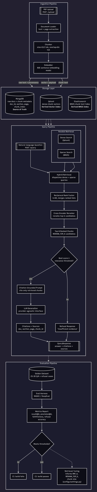

# LexRAG — Case Study

A legal contract & case-law RAG platform that cites only what it retrieved — and refuses to answer when the evidence isn't there.

> **Self-directed portfolio project.** Not a production deployment for a real firm. Built to practice a genuinely hard RAG problem: retrieval and generation quality measured against a golden dataset and enforced as a CI quality gate, not tuned by eyeballing outputs. Every number below is a real, measured result from the evaluation harness — including the ones that don't yet clear the target bar. See [Resources](#resources) for the full evaluation methodology.

`FastAPI` `Qdrant` `Elasticsearch` `RAGAS` `CI Quality Gate`

## 1 · The Problem

Paralegals burn hours per matter manually searching thousands of pages of contracts and prior filings for relevant clauses and precedent. Keyword search misses paraphrased queries; a generic LLM chat interface answers confidently without evidence, which is unusable — and risky — for legal work.

- Finding relevant clauses across large PDF corpora, including paraphrased queries keyword search misses
- Citing only passages actually retrieved, not the model's own recollection
- Refusing to answer — explicitly — when the corpus doesn't contain sufficient evidence
- Proving retrieval and generation quality with numbers, not eyeballed outputs
- Keeping query latency usable, not a multi-minute wait per question

## 2 · Objectives

- **Hybrid retrieval** — dense vector + BM25 keyword search, merged via Reciprocal Rank Fusion
- **Cross-encoder reranking** of fused candidates before generation
- **Citation-grounded generation** that cites only retrieved passages
- **Explicit refusal** when evidence is insufficient, not a confident guess
- **A CI quality gate** that fails the build if measured quality regresses

| | | | |
|---|---|---|---|
| **30** golden Q/A cases, 22 positive + 8 adversarial | **7** real SEC-filed contracts in the golden corpus | **4** metrics gated in CI: recall, precision, faithfulness, refusal | **6** sprint days, all shipped |

## 3 · Solution

LexRAG ingests PDF contracts and case-law documents, indexes them for hybrid retrieval, and generates answers that cite only retrieved passages — refusing to answer when the corpus doesn't contain sufficient evidence.

```
Ingest (chunk + embed) → Hybrid Retrieval (dense + BM25, RRF) → Rerank (cross-encoder) → Generate (cite or refuse) → Evaluate (golden dataset)
```

Retrieval and generation quality are measured against a golden dataset and enforced as a CI quality gate — not tuned by eyeballing outputs.

## 4 · Technologies Used

- **FastAPI** — async API for upload, query, document management
- **MongoDB** — document metadata & provenance store
- **Qdrant** — dense vector search
- **Elasticsearch** — BM25 keyword search
- **bge-m3 / bge-reranker-v2-m3** — embeddings + cross-encoder reranker
- **RAGAS + DeepEval** — golden-dataset evaluation harness
- **Docker Compose** — full local stack: API + Mongo + Qdrant + ES
- **GitHub Actions** — lint/type/test CI + evaluation quality gate

## 5 · Challenges Solved

**Reranker latency was the real bottleneck** — Capping pre-rerank candidates (`RERANK_INPUT_TOP_K` 20 → 12, validated against every positive case's expected document staying in the reranked top 8) cut average reranker latency from 53.5s to 23.4s — more than half — without a measured recall cost.

**ONNX Runtime was measured and rejected** — An ONNX Runtime backend for the same reranker model was benchmarked, not assumed: 1.02x speedup — not a real win — so the added dependency wasn't worth it. The CPU-bound reranker remains ~9x over the P95 latency budget with no GPU/DirectML path on the development machine.

**The `confidence` field doesn't mean what it looks like** — A follow-up analysis measured the actual correlation between the API's `confidence` field and answer correctness: Pearson r ≈ 0. It reflects the reranker's relevance score for the single best-matching chunk, not a calibrated answer-confidence score — one answer scored 0.92 while being completely unfaithful. Documented plainly rather than left to be misread.

**Refusal is improved, not solved** — A targeted generation-prompt fix (`LEGAL_RAG_V2`) closed one of three measured false acceptances, but two adversarial cases — both topically-relevant-but-non-answering evidence — still survive. 100% refusal on negative cases remains the one currently-failing CI gate criterion, tracked openly rather than declared done.

## 6 · Architecture

Ingestion fans out to MongoDB (metadata/provenance), Qdrant (dense vectors), and Elasticsearch (BM25 index) in parallel; a document is only marked `status: ready` once every store write is validated, so a partial ingestion failure can't silently leave a queryable-but-incomplete document. The query path runs dense and keyword search in parallel, fuses results with Reciprocal Rank Fusion, reranks the fused candidates with a cross-encoder, then generates a cited answer or refuses.


*System architecture: PDF ingestion pipeline feeding MongoDB/Qdrant/Elasticsearch, a hybrid retrieval query pipeline with RRF fusion and cross-encoder reranking, and an evaluation pipeline gating CI.*

## 7 · Evaluation Results

Same 7-document real-contract corpus, same 30 golden cases, one model swap (`gpt-5.6-luna` → `gpt-4.1-mini`, the project's actual configured default) plus two targeted changes: a lower rerank candidate cap and a refusal-prompt fix.

| Metric | Day 5 | Day 6 | Target |
|---|---|---|---|
| Recall@10 (hybrid) | 1.00 | 1.00 | ✅ ≥ 0.85 |
| Precision@5 (hybrid) | 0.88 | 0.88 | ✅ ≥ 0.70 |
| Faithfulness | 0.95 | 0.98 | ✅ ≥ 0.90 |
| Refusal accuracy | 93.33% | 90.00% | — (see below) |
| Avg reranker latency | 53.5s | 23.4s | — |
| Avg end-to-end latency | 56.4s | 26.3s (-53%) | ❌ ≤ 6s (P95) |
| Negative-case false acceptances | 2 | 2 | ❌ target is 0 |

*Single-run measurements — RAGAS/DeepEval LLM-judge scores aren't perfectly deterministic run-to-run; treat every number here as directional, per the project's own documented caveat.*

## 8 · Testing & CI

`make check` — Ruff lint, Ruff format check, mypy, and pytest — runs on every push and PR via GitHub Actions, identical to what CI runs. A separate `evaluation-gate` job checks the golden-dataset harness's output against documented thresholds (recall@10 ≥ 0.85, precision@5 ≥ 0.70, faithfulness ≥ 0.90, zero false acceptances) and exits non-zero on failure — demonstrated on the record both failing and passing against real and deliberately degraded configurations.

| Check | What it verifies |
|---|---|
| `ruff check` / `format` | Lint and formatting, 100-char line length |
| `mypy` | `disallow_untyped_defs` — every function signature is typed |
| `pytest` | Unit suite, zero external services, under 60s (NFR-5) |
| `evaluation-gate` (FR-12) | Recall/precision/faithfulness/refusal against the golden dataset, self-hosted runner |

## 9 · Results

| | | | |
|---|---|---|---|
| **1.00** Recall@10, hybrid retrieval (target ≥ 0.85) — VERIFIED | **0.98** Faithfulness (target ≥ 0.90) — VERIFIED | **-53%** end-to-end query latency, Day 5 → Day 6 — VERIFIED | **2/30** negative cases still incorrectly answered — OPEN GAP |

*This is a portfolio build measured against its own golden dataset, not production usage. The CI gate's one currently-failing criterion (100% negative-case refusal) is stated openly — see [Technical Architecture](technical-architecture.md) Section 7 for the full known-limitations list.*

## 10 · Key Takeaways

1. A retrieval-relevance score and an answer-correctness score are not the same thing — conflating them is an easy, dangerous mistake in a RAG API's response contract.
2. Enforcing quality thresholds in CI, not eyeballing outputs, is what turns "the demo looked good" into a real regression gate.
3. Benchmarking a proposed optimization (ONNX) before adopting it caught a 1.02x non-improvement that would otherwise have added a dependency for nothing.
4. Refusal is a generation-stage judgment call, not just a retrieval-quality problem — the two remaining false acceptances are cases where retrieval worked correctly and generation still overreached.
5. Dual-write consistency across three stores needs an explicit "not ready until every write succeeds" rule — it doesn't fall out of any one store's own guarantees.
6. Reporting a metric as "directional, not proven" when it isn't run-to-run deterministic is more useful than a false sense of precision.

## Resources

Want to verify or explore this further? Here you go.

| | |
|---|---|
| **GitHub repository** — full source, commit history, CI configuration | [github.com/Terrytd0/LexRag](https://github.com/Terrytd0/LexRag) |
| **README** — setup, features, benchmark numbers, known limitations | [README.md](https://github.com/Terrytd0/LexRag/blob/main/README.md) |
| **Evaluation notes** — full Day 6 methodology, every intermediate measurement | [docs/experiments/evaluation_notes_day6.md](https://github.com/Terrytd0/LexRag/blob/main/docs/experiments/evaluation_notes_day6.md) |
| **ADR-001** — the ONNX reranker backend decision, benchmarked and rejected | [docs/adr/001-reranker-onnx-backend.md](https://github.com/Terrytd0/LexRag/blob/main/docs/adr/001-reranker-onnx-backend.md) |
| **Technical Architecture** — the companion document to this case study | [technical-architecture.md](technical-architecture.md) |
| **Full docs folder** — requirements, architecture ADR, experiment notes | [docs/](https://github.com/Terrytd0/LexRag/tree/main/docs) |

---
*LexRAG · Case Study · Self-directed portfolio project*
